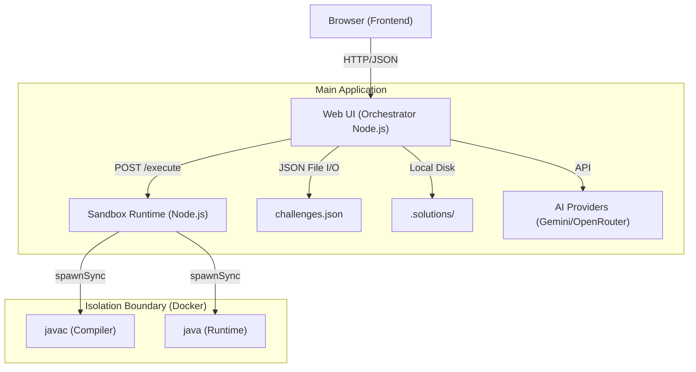
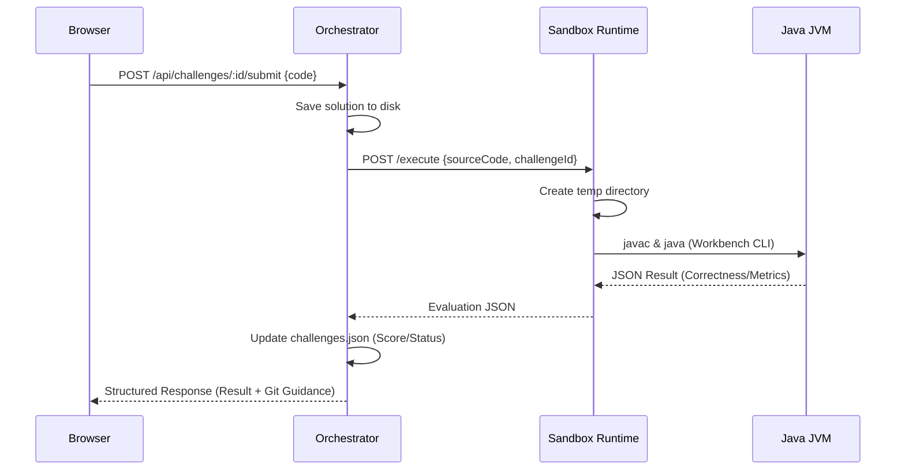

# Architecture Overview: Java Interview Practice Platform

This document describes the high-level architecture of the Java Interview Practice platform, a containerized system for learning and practicing Java coding challenges.

## System Components

The platform follows a distributed architecture composed of two primary services and several auxiliary components.



### 1. Web UI (Orchestrator)
The orchestrator is a Node.js Express server (`web-ui/server.js`) that serves as the entry point for users. It handles:
- **Routing**: Serves the SPA frontend and exposes a RESTful API.
- **Challenge Management**: Loads challenge metadata and rules from `challenges.json`.
- **State Persistence**: Tracks user progress, scores, and saves solutions to the filesystem.
- **AI Integration**: Routes requests for hints and code reviews to LLM providers (Gemini/OpenRouter).
- **Execution Orchestration**: Proxies compilation and execution requests to the Sandbox Runtime.

### 2. Sandbox Runtime
A specialized Node.js service (`sandbox-runtime/server.js`) designed to safely execute untrusted Java code.
- **Isolation**: Runs inside a hardened Docker container.
- **Statelessness**: Each execution job uses a temporary directory that is purged immediately after the results are returned.
- **Policy Enforcement**: Validates execution parameters (timeout, memory, network mode) against a security policy.
- **Java Harness**: Compiles the user's solution alongside a baked-in test harness and returns results in a structured JSON format.

### 3. Data Storage
- **`challenges.json`**: The central source of truth for all challenge data (metadata, markdown descriptions, scoring rules).
- **`.solutions/`**: Stores user-submitted source code, organized by user and challenge.
- **Local Git**: The system provides Git-based guidance for users to track their progress locally.

## Core Data Flows

### Challenge Submission Flow



## Security & Isolation

The platform implements multiple layers of protection:
- **Containerization**: Sandbox runs in a dedicated container with restricted capabilities.
- **Resource Limits**: Configurable max memory (`SANDBOX_MAX_MEMORY_MB`) and timeout (`SANDBOX_MAX_TIMEOUT_MS`).
- **Network Isolation**: Deny-by-default egress. Network access is only granted to specific challenges via explicit environment configuration.
- **Filesystem Hardening**: User code is written to a non-persistent `tmpfs` or purged temporary directory.

## Directory Structure

```bash
.
├── web-ui/             # Orchestrator & Frontend
│   ├── src/node/       # Backend service modules
│   ├── src/browser/    # Frontend logic (CodeMirror 6, etc.)
│   ├── views/          # EJS templates
│   └── server.js       # Main entry point
├── sandbox-runtime/    # Isolated execution service
│   ├── server.js       # Runtime server
│   └── Dockerfile      # Sandbox container definition
├── openspec/           # Living specifications (OpenSpec)
├── src/main/java/      # Core Java workbench logic & challenges
├── challenges.json     # Central challenge data store
└── DESIGN.md           # Visual design system & UI guidelines
```
